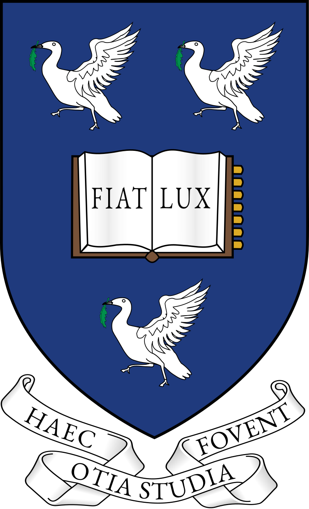

<p align="center">
  <a href="https://www.liverpool.ac.uk/" target="blank">
    
  </a>
 <h1 align="center" style="font-weight: 600"> Stencil HPC Solver for COMP328 High Performance Computing </h1>
 <h3 align="center">⭐ If this project helped you, please star it. Thanks for your support!</h3>

## Intro
This project is a complete implementation of a **high-performance stencil solver** using both **OpenMP** and **MPI** for parallelization. It tackles a computational linear algebra problem commonly found in image processing and scientific computing.

The project is implemented in C and tested on the University of Liverpool's **Barkla** HPC cluster. It includes multiple execution models:
- A multi-threaded OpenMP implementation (`stencil.c`)
- A nearly-serial driver for local execution (`main-nearly.c`)
- A distributed MPI implementation (`main-mpi.c`)
- A Makefile for building different variants with GNU and Intel compilers (`Makefile`)
- 4 SLURM scripts for submitting jobs to Barkla for both strong and weak scaling experiments

## Must See Before Read My Code
* Operating System: Linux (HPC cluster - Barkla)
* Programming Language: C (with OpenMP and MPI)
* Compilers: GNU (`gcc`, `mpicc`) and Intel (`icc`, `mpiicc`)
* All code is academic coursework and was uploaded **after** the assignment deadline.
* Please refer to university guidelines regarding academic integrity before using this code.

⚠️ Please adhere to the University's Academic Integrity Policy. I accept no responsibility for misuse of this code.

## Module Specification
* Year: 2025
* Module Lead: Henry Forbes  
* Co-academic: Joshua Alcock

---

## Project Structure

| File | Description |
|------|-------------|
| `CA1_setup.sh` | Initial environment setup script for Barkla |
| `compare.c` | Utility to compare output with ground truth |
| `file-reader.c` | Handles I/O for matrix and filter files |
| `main-nearly.c` | Nearly-serial implementation of stencil pipeline |
| `main-mpi.c` | Full distributed MPI version of the stencil solver |
| `Makefile` | Builds 4 variants (GCC/Intel × Nearly/Complete) |
| `report.pdf` | Final project report containing experimental analysis |
| `stencil.c` | Core stencil solver using OpenMP |
| `strong_scaling_gcc.sh` | SLURM script for strong scaling (GCC) |
| `strong_scaling_icc.sh` | SLURM script for strong scaling (Intel) |
| `weak_scaling_gcc.sh` | SLURM script for weak scaling (GCC) |
| `weak_scaling_icc.sh` | SLURM script for weak scaling (Intel) |

---

## Features

✅ Implements a 2D convolution stencil on 3D data  
✅ Efficient use of OpenMP for thread-level parallelism  
✅ Uses MPI to distribute matrices across processes  
✅ Supports both GCC and Intel compiler toolchains  
✅ Strong and weak scaling experiments included  
✅ Optimisation reports via `-qopt-report3` for Intel builds  
✅ Barkla-compliant SLURM submission scripts

---

## Compilation

Make targets:

```bash
make gccnearly      # stencil-nearly-gcc (GCC, OpenMP)
make gcccomplete    # stencil-complete-gcc (GCC, OpenMP + MPI)
make iccnearly      # stencil-nearly-icc (Intel, OpenMP + optimisation report)
make icccomplete    # stencil-complete-icc (Intel, OpenMP + MPI + report)
